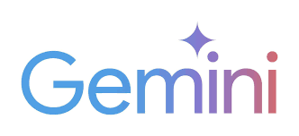
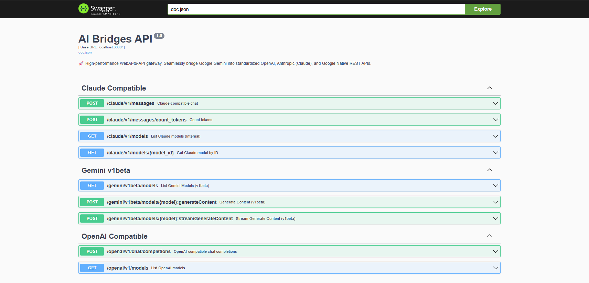

<p align="center">
  
</p>

<p align="center">
  <a href="https://golang.org/"></a>
  <a href="https://www.docker.com/"></a>
  <a href="https://github.com/ntthanh2603/gemini-web-to-api/blob/main/LICENSE"></a>
  
  <a href="https://modelcontextprotocol.io/"></a>
</p>

<h1 align="center">Gemini Web-to-API & MCP Proxy 🚀</h1>

<p align="center">
  <b>Phiên bản nâng cấp 2026</b> với khả năng quản lý đa tài khoản, nghiên cứu chuyên sâu (Deep Research) <br/>
  và tích hợp trực tiếp giao thức <b>Model Context Protocol (MCP)</b> cho Antigravity.
</p>

> [!IMPORTANT]
> Dự án này đã chuyển sang cơ chế **Self-Build (tự xây dựng)** hoàn toàn để đảm bảo tính riêng tư và tùy biến tối đa. Chúng tôi không còn hỗ trợ các image dựng sẵn trên Registry công cộng.

---

## 🎯 Tại sao chọn Gemini Web-to-API?

Dự án này vượt xa một proxy đơn thuần, nó giải quyết các vấn đề thực tế khi sử dụng Gemini Web cho các tác vụ tự động hóa:

- ✅ **Quản lý đa tài khoản (Account Pool)**: Tự động xoay vòng (rotation) và cân bằng tải giữa các tài khoản Google để tránh giới hạn (Rate Limits).
- ✅ **Deep Research**: Chế độ nghiên cứu đa bước, tự động tìm kiếm và tổng hợp thông tin từ web với khả năng suy luận logic chuyên sâu.
- ✅ **Tích hợp MCP Native**: Hỗ trợ chuẩn giao thức MCP (SSE transport), cho phép các AI Agent như Antigravity sử dụng Gemini Web như một tập hợp các Tool mạnh mẽ.
- ✅ **Độ tin cậy Pro-grade**: Tích hợp cơ chế **Heartbeat** (giữ kết nối), **Pacing** (giãn cách request) và **Cooldown** (nghỉ ngơi tài khoản) để mô phỏng hành vi người dùng, tránh bị khóa tài khoản.
- ✅ **Tương thích hoàn toàn**: Giả lập các endpoint của OpenAI, Claude và Gemini Native.

---

## 🚀 Hướng dẫn Build và Cài đặt (Self-Build)

Vì đây là phiên bản mới nhất, bạn cần build image trực tiếp trên môi trường của mình.

### Bước 1: Clone Repository
```bash
git clone https://github.com/chonguoimuon/gemini-web-multi-to-api.git
cd gemini-web-multi-to-api
```

### Bước 2: Thiết lập cấu hình (.env)
Tạo file `.env` từ mẫu có sẵn:
```bash
cp .env.example .env
```
Chỉnh sửa các thông số quan trọng:
- `ADMIN_API_KEY`: Mật khẩu để truy cập Dashboard và Auth cho MCP.
- `GEMINI_1PSID` & `GEMINI_1PSIDTS`: Cookie tài khoản chính (xem hướng dẫn lấy cookie bên dưới).

### Bước 3: Build và Chạy bằng Docker Compose
Đây là cách nhanh nhất và ổn định nhất:
```bash
docker compose up -d --build
```
Hệ thống sẽ tự động build image từ mã nguồn hiện tại và khởi chạy dịch vụ tại cổng `4982`.

---

## 🔑 Cách lấy Cookies Gemini

1. Truy cập [gemini.google.com](https://gemini.google.com) và đăng nhập.
2. Nhấn `F12` -> **Application** -> **Storage** -> **Cookies**.
3. Tìm và copy giá trị của:
   - `__Secure-1PSID`
   - `__Secure-1PSIDTS` (Bắt buộc để tránh lỗi xác thực).

---

## 🔌 Thiết lập kết nối

### 1. Tích hợp MCP với Antigravity
Để sử dụng Gemini Web như một Tool trong Antigravity, hãy thêm cấu hình sau vào `mcp_config.json`:

```json
{
  "mcpServers": {
    "gemini-web-multi": {
      "serverUrl": "https://your-domain.com/mcp",
      "headers": {
        "accept": "application/json",
        "Authorization": "Bearer YOUR_ADMIN_API_KEY"
      }
    }
  }
}
```
*Lưu ý: Thay `YOUR_ADMIN_API_KEY` bằng giá trị bạn đã thiết lập trong file `.env`.*

### 2. Sử dụng như API OpenAI (Dành cho n8n, Chatbox, Cursor...)
- **Base URL**: `http://localhost:4982/openai/v1`
- **API Key**: `YOUR_ADMIN_API_KEY`
- **Model**: `gemini-advanced` hoặc `gemini-pro`

---

## 📘 Dashboard Quản trị & Giám sát

Truy cập **`http://localhost:4982/swagger/index.html`** hoặc giao diện hiện đại **Scalar** tại **`http://localhost:4982/docs`** để:
- Xem danh sách các công cụ MCP khả dụng.
- Kiểm tra trạng thái "sức khỏe" (Healthy/Banned) của từng tài khoản trong Pool.
- Thêm hoặc xóa tài khoản Gemini trực tiếp không cần restart server.

> [!TIP]
> **Scalar** (`/docs`) cung cấp trải nghiệm quản lý API trực quan và hiện đại hơn so với Swagger truyền thống. Cả hai giao diện đều chạy song song để phục vụ việc kiểm tra hệ thống.



---

## 🛠️ Cơ chế Hoạt động Thông minh

Dự án tích hợp các thuật toán đặc biệt để đảm bảo tính bền bỉ:
- **Pacing Delay**: Tự động nghỉ 1.5s giữa các bước Research để tránh bị Google quét bot.
- **Account Cooldown**: Khi một tài khoản bị lỗi `Access Denied`, hệ thống sẽ cho tài khoản đó "nghỉ ngơi" 2-5 phút trước khi thử lại.
- **Heartbeat Connection**: Duy trì kết nối SSE liên tục ngay cả với các tác vụ Research dài trên 5 phút, tránh bị Cloudflare ngắt tunnel.

---

## 📄 Giấy phép
Dự án được phát hành dưới giấy phép MIT. Chỉ sử dụng cho mục đích nghiên cứu và học tập.

**Made with ❤️ by the Gemini Web To API team**